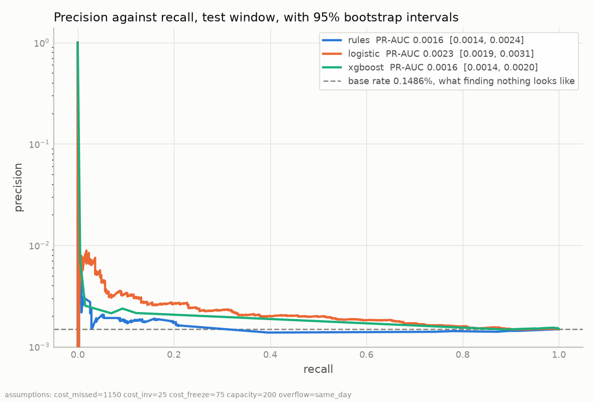

# Results

The [README](../README.md) states the operating point and the finding the project depends on. This
page carries the comparisons under it. The terms that carry the argument are defined here as they
appear, and the [glossary](glossary.md) defines the rest. Every figure is the published LI-Small
variant unless the text says otherwise.

## The hand-written rules the models must beat

A money mule is a person whose bank account receives money that came from a crime and sends it
onward. The pipeline scores each account from four days of history, called the feature window. The
two days that follow are the label window. A mule account is an account that received at least one
payment the simulator marked as laundering inside its label window.

Before any model there is a rule that needs no training data and nothing fitted. It flags an account
when both of these are true.

- The account received an unusual number of payments. The measure is in-degree, the count of
  payments arriving during the feature window. The cut is the top 1%.
- The account sent most of that money out again. The measure is the pass-through ratio, the money
  leaving divided by the money arriving. The cut is 0.8, so at least 80 cents left for every euro
  that came in.

Both cuts are set in `config/params.yaml`. Both were fixed before the first model ran.

The 0.8 cut is loose on this data. The ratio reaches near 3,600 at its 99th percentile on the test
window, so 0.8 falls between the median and the 75th percentile. It passes 26% of the population.

A daily budget needs an order over accounts. The scorer in every comparison here is that same rule
turned into a ranking: the lower of the account's two percentile ranks. The ranking never reads the
0.8. `tests/test_models.py` asserts that the score is unchanged when the two cuts are replaced with
0.01 and a billion. The tables below therefore measure the ranking, and the flag is reported in both
forms.

| Test window, 260,459 accounts | Flagged | Mule accounts caught of 387 | Precision |
| --- | --- | --- | --- |
| as configured, top 1% in-degree and ratio above 0.8 | 388 | 0 | 0.0000% |
| both conditions cut at the 99th percentile | 5 | 0 | 0.0000% |

The two forms give the same verdict. The configured form flags 388 accounts and catches nothing. A
random 388 accounts would be expected to include 0.58 mule accounts, so catching none is what a
random draw does. The matched form flags 5 accounts, which expect 0.007 mule accounts between them.
It uses the percentile already configured for the in-degree condition. On HI-Small the configured
form catches one mule account in 312 flags, which is the same verdict.

A model score means little on its own, so the rule sets the level to beat. Every scorer here is
measured by PR-AUC, the area under the precision-recall curve. It rises when mule accounts rank
nearer the top. A scorer that has learned nothing scores the base rate, which is the share of the
population that are mule accounts, 0.1486% on this window. The rules reach 1.08 times that number,
logistic regression 1.56 times, and XGBoost 1.10 times.

Each gap between two scorers was recomputed on 1,000 random re-draws of the same accounts. Four of
the six gaps across the two windows cross zero. On HI-Small none of the six does, and XGBoost
reaches 3.11 times the base rate. That is the difference between the two variants in one line.

## How the three scorers compare

XGBoost does not separate from the hand-written rules on this variant, and logistic regression beats
both.

The table is the test window PR-AUC, with 95% intervals over 1,000 re-draws of the 260,459 scored
accounts. A scorer that has learned nothing scores its window's base rate of 0.001486.

| Scorer | PR-AUC | 2.5% | 97.5% |
| --- | --- | --- | --- |
| rules | 0.001609 | 0.001359 | 0.002355 |
| logistic | 0.002315 | 0.001898 | 0.003146 |
| xgboost | 0.001633 | 0.001423 | 0.001972 |

The three intervals overlap, so the paired differences answer the question. On each re-draw both
scorers see the same accounts, so the sampling variation they share cancels. An interval that
crosses zero leaves the sign of the difference unestablished.

| Comparison | Difference | 2.5% | 97.5% | Crosses zero |
| --- | --- | --- | --- | --- |
| xgboost - rules | 0.000024 | -0.000720 | 0.000354 | yes |
| xgboost - logistic | -0.000682 | -0.001426 | -0.000266 | no |
| logistic - rules | 0.000706 | -0.000068 | 0.001473 | yes |

**The middle row is the one to read first.** XGBoost does not separate from the rules baseline here.
Logistic regression beats it by a margin whose interval stays below zero. This variant produces a
different ordering from the one the project expected.

XGBoost kept 1 tree of an allowed 400 before early stopping, on one fixed configuration with no
hyperparameter search. One tree of depth 6 gives its score **21 distinct values across 260,459
accounts**. Almost every account ties with thousands of others, so the ranking has 21 levels. Its
gain-weighted feature importance is flat: the top measure carries 7.5% and the eighth carries 5.9%.
The pass-through ratio ranks ninth, at 5.6%.

On HI-Small the same code, settings and seed keep 8 trees. They produce 11,142 distinct scores over
190,773 accounts, and every paired interval clears zero. The graph is the best explanation for both
results. The feature window graph has a mean degree of 2.39, and local clustering is exactly zero
for 97.6% of accounts. Four days of this dataset contain almost no graph. Doubling the history to
eight days moves the mean degree to 2.928. It still leaves 93.57% of accounts in no triangle, so the
limit is the dataset. Those graph figures are HI-Small's, from the history scan.

## Which assumption moves the answer

The economics rests on four numbers, and three of them cannot change which accounts get opened.
The threshold is the score of the last account inside the budget. The sweep multiplies each of the
four numbers by 0.25, 0.5, 1, 2 and 4, then reads the operating point again.

| What is multiplied | Threshold | Caught of 387 |
| --- | --- | --- |
| cost of a missed mule | 0.517247 at all five | 5 at all five |
| cost of an investigation | 0.517247 at all five | 5 at all five |
| cost of a wrong freeze | 0.517247 at all five | 5 at all five |
| analyst capacity per day | 0.517247, and 0.513175 at 800 a day | 4, 4, 5, 6, 8 |

Fifteen of the twenty rows are the three cost parameters, and none of them moves the threshold at
all. Under a fixed budget the threshold is a rank. A cost changes what an alert is priced at, and
never which account gets one.

Capacity is the row that moves. At 50 cases a day the budget opens 100 alerts and catches 4. At 800
a day it opens 1,600 and catches 8, and the threshold falls to 0.513175 because the budget reaches
further down the ranking. That row is also the only one in the whole sweep where the net turns
positive, at 1,365,381 EUR a day.

## Cases not reviewed within the daily budget

The policy for unreached accounts moves the operating point by at most one caught account, in either
direction.

An account can pass the threshold and still never be opened, because the day's 200 slots are spent
before the queue ends. This project discards the unreached accounts at the end of the day. The specification asked for the other
policy: carry them into the next day, so yesterday's leftovers compete with today's new cases. Both
policies were measured on the same queue, with the prediction written down first.

| Test window, XGBoost | Alerts | Spent on yesterday's leftovers | Caught of 387 | precision@k | Net EUR/day |
| --- | --- | --- | --- | --- | --- |
| discard at the end of the day | 400 | 0 | 5 | 1.2500% | -210,409 |
| carry the backlog forward | 400 | 82 | 4 | 1.0000% | -218,473 |

Carrying the backlog spent 82 of day two's 200 slots on accounts that day one had already declined
to reach. It lost one catch by doing so. precision@k is the share of the 400 alerts that are mule
accounts.

**The direction differs by scorer.** Across the six scorer-and-window comparisons, the alternative
policy improves the operating point in two, makes it worse in one, and leaves it unchanged in three.
The largest movement either way is a single caught account. On HI-Small it improves nothing, makes
two worse, and leaves four unchanged. A blanket claim about which policy is better fails on a second
file, so the report counts the direction in each comparison.

The size of the effect is the calendar. A backlog needs a quiet day after a busy one to have
anywhere to go. The test window has one and the validation window does not. On validation every
catch, threshold, and euro figure is the same under both policies.

**No interval was computed for any of it.** So the reading is an observation about direction and not
a result. The policy is named `rollover_max_3d` and expires a case after three days. A two-day label
window never reaches three days, so what was measured is a single carry. Both forms are in
`reports/report.md`, and the configured default is the discard policy.

## Data drift, and the limits of measuring it

Every build measures how far the data moved between the training window and each later one. Two
properties of the measure decide how far each row can be read.

The measure is the Population Stability Index, PSI. The pipeline cuts the training window into 10
bins of equal size. It applies those same bin edges to the later window and compares how the mass is
spread across them.

**A large value can be a property of the data, or a property of a setting.** When a bin is empty on
one side, the zero has to be replaced before taking a logarithm. The size of that bin's term then
comes from the replacement. On the test window the rules baseline reads 8.7802 with six of
its ten bins empty, so the project prints it as a flag. Fifteen of the twenty measures fall on this
side. Five produce a number that can be read as a distance, and the rest signal that a bin emptied.
Every row this project prints says which it is.

The scorer rows say the same about the model as the PR-AUC table does. XGBoost's own score drift
reads 0.6788, with four of ten bins empty and only eight distinct reference edges, so the value is a
flag. A score distribution that has collapsed to eight distinct quantile edges on its own training
window is not ranking much. On HI-Small the same row reads 0.3711, with no empty bins.

**A value of exactly zero can mean the measure is blind.** One measure, reciprocity, reads 0.0000,
which looks like perfect stability. It takes the value zero for 99.55% of accounts in the training
window. Every quantile boundary falls on the same number, both windows fall into one bin, and PSI
cannot detect any movement. A zero here means PSI cannot see that feature at all. Reciprocity reads
0.0000 on HI-Small for the same reason, so this is a property of PSI meeting a degenerate feature.

The drift comes from the calendar. The training window contains the two busiest days in the file and
the later windows do not. None of this supports a claim about a model degrading over time. The full
tables are in [reports/report.md](../reports/report.md), and the figures are under
`reports/figures/`.
