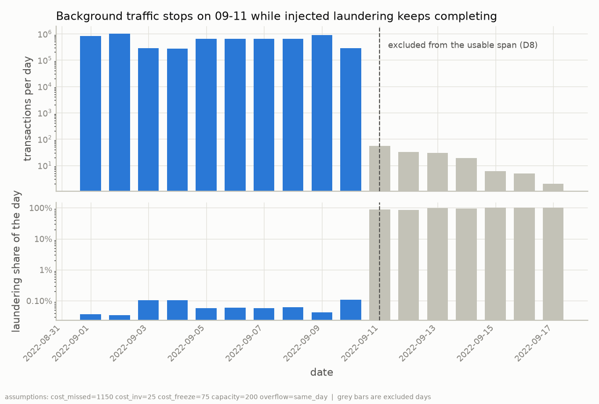
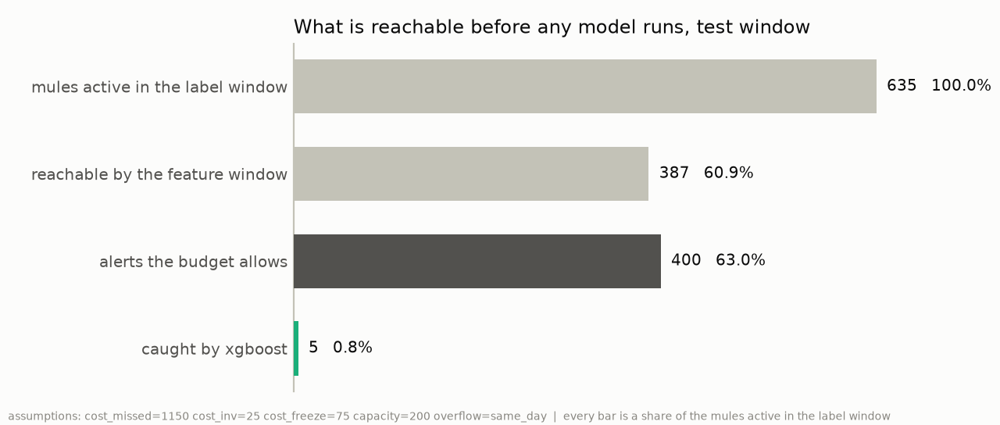
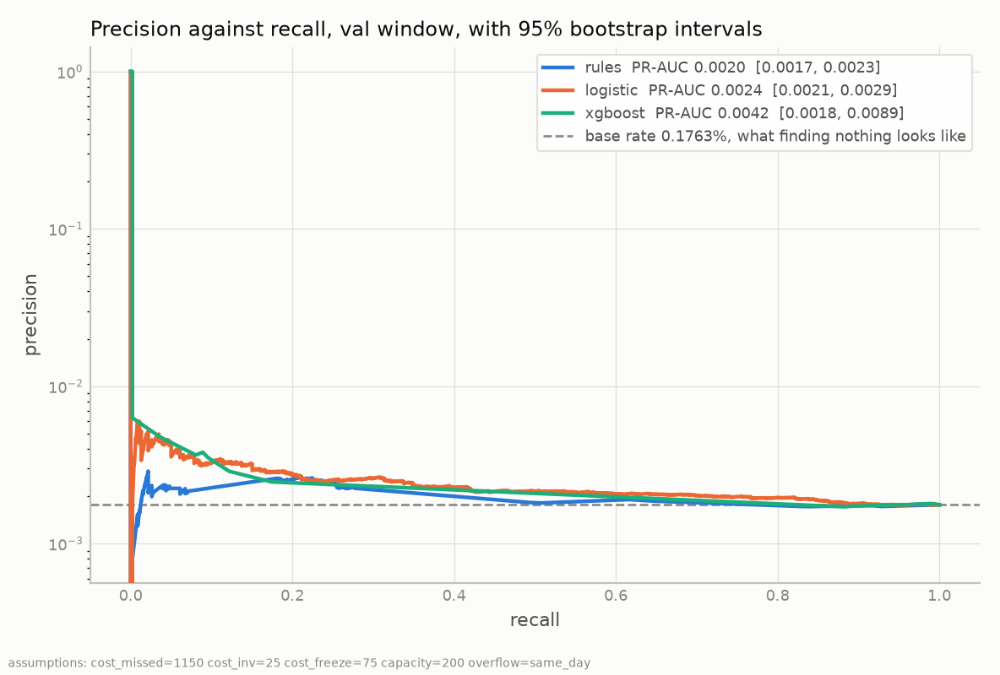
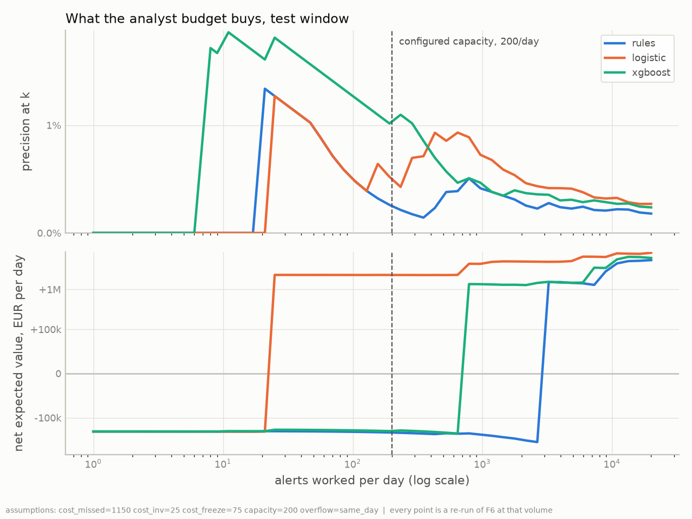
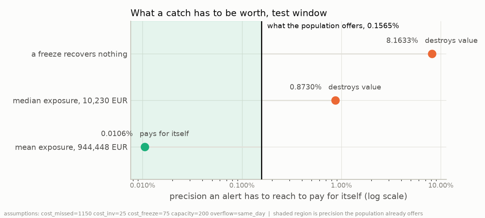

# Where the Money Goes Next: results

`make report` generates this document. Every figure comes from an upstream stage that measured
it and wrote it to a metrics file. This module computes nothing.

**A simulator generated the labels.** Nothing below is a detection claim about money
laundering. Three of the four cost parameters are assumptions.

The terms used here are defined in `docs/glossary.md`.

Active assumptions: `assumptions: cost_missed=1150 cost_inv=25 cost_freeze=75 capacity=200 overflow=same_day`

## The data, after two exclusions

Rows read: 6,924,049, over 705,907 accounts keyed as (bank, account).
One account is one (bank, account) pair, so the same account number at two banks counts twice.
Self-transfers removed at load: 804,477, carrying
3 laundering rows. A self-transfer has the same account on
both sides. The observed span is 2022-09-01 00:00:00 to 2022-09-17 15:28:00.
6,119,424 rows fall inside the usable span 2022-09-01 00:00:00 to
2022-09-11 00:00:00.

The cliff in that chart is the evidence for excluding everything from 09-11 onward. Ordinary
traffic falls by a factor of about a thousand, and the laundering share rises from about 0.1% to
near 100%. Stating that rule needs no label at all, which is the test every exclusion in this
project has to pass.

Each split below has its own feature window, and the label window that follows it. The population
is the accounts that received money during the feature window.

| split | population | mule accounts | base rate | unreachable | reachability ceiling |
| --- | --- | --- | --- | --- | --- |
| train | 375,177 | 564 | 0.1503% | 150 | 79.0% |
| val | 260,410 | 459 | 0.1763% | 282 | 61.9% |
| test | 260,459 | 387 | 0.1486% | 248 | 60.9% |

**The reachability ceiling is a limit no model can pass.** It is the share of the label window's
mule accounts that fall inside the population. An account with no incoming payment before the
cutoff has no features, so the pipeline cannot score it. The `unreachable` column counts the
mule accounts left outside.

Both ceilings use one denominator: the mule accounts active in the test label window.

## The model against the rules, validation window

PR-AUC is the area under the precision-recall curve. It rises when mule accounts rank nearer the
top. A scorer that has learned nothing scores the base rate, which is the share of the population
that are mule accounts. The 2.5% and 97.5% columns are the range the middle 95% of
1,000 re-draws fall in.

| scorer | PR-AUC | 2.5% | 97.5% |
| --- | --- | --- | --- |
| rules | 0.001972 | 0.001740 | 0.002285 |
| logistic | 0.002411 | 0.002073 | 0.002910 |
| xgboost | 0.004183 | 0.001810 | 0.008852 |

Paired differences. Both scorers see the same re-drawn accounts, so the variation they share cancels. `crosses zero` means the interval includes zero, so the sign of the difference is not established.

| comparison | difference | 2.5% | 97.5% | crosses zero |
| --- | --- | --- | --- | --- |
| xgboost - rules | 0.002211 | -0.000202 | 0.006908 | yes |
| xgboost - logistic | 0.001772 | -0.000742 | 0.006532 | yes |
| logistic - rules | 0.000439 | 0.000118 | 0.000849 | no |

## The same comparison on the test window

XGBoost uses the validation window to early-stop, so the validation scores are optimistic and
the test window is the clean comparison.

| scorer | PR-AUC | 2.5% | 97.5% |
| --- | --- | --- | --- |
| rules | 0.001609 | 0.001359 | 0.002355 |
| logistic | 0.002315 | 0.001898 | 0.003146 |
| xgboost | 0.001633 | 0.001423 | 0.001972 |

Paired differences. Both scorers see the same re-drawn accounts, so the variation they share cancels. `crosses zero` means the interval includes zero, so the sign of the difference is not established.

| comparison | difference | 2.5% | 97.5% | crosses zero |
| --- | --- | --- | --- | --- |
| xgboost - rules | 0.000024 | -0.000720 | 0.000354 | yes |
| xgboost - logistic | -0.000682 | -0.001426 | -0.000266 | no |
| logistic - rules | 0.000706 | -0.000068 | 0.001473 | yes |

Trees kept by XGBoost: 1, of an allowed 400. The
pipeline measured `scale_pos_weight` from the training labels at 664.21.
That setting tells XGBoost how much more one mule account counts than one clean account. The
training window holds 374,613 clean accounts and 564 mule
accounts.

## The operating point under a fixed analyst budget

An alert is an account the analyst team opens and works. The budget allows
200 alerts a day, and the `alerts` column is the total over the
label window. `precision@k` is the share of those alerts that are mule accounts. The threshold is
the score of the last account inside the budget.

Validation window:

| scorer | alerts | caught | precision@k | recall | threshold | net EUR/day |
| --- | --- | --- | --- | --- | --- | --- |
| rules | 400 | 0 | 0.0000% | 0.00% | 0.949952 | -283,925 |
| logistic | 400 | 0 | 0.0000% | 0.00% | 0.754570 | -283,925 |
| xgboost | 400 | 4 | 1.0000% | 0.87% | 0.517247 | 527,857 |

Test window:

| scorer | alerts | caught | precision@k | recall | threshold | net EUR/day |
| --- | --- | --- | --- | --- | --- | --- |
| rules | 400 | 1 | 0.2500% | 0.26% | 0.945742 | -236,784 |
| logistic | 400 | 2 | 0.5000% | 0.52% | 0.759166 | 2,315,015 |
| xgboost | 400 | 5 | 1.2500% | 1.29% | 0.517247 | -210,409 |

### Accounts the capacity did not reach

`queue_overflow_policy` is configured as `same_day`. It discards, at
the end of the day, everything above the threshold that the budget did not reach.
The alternative is `rollover_max_3d`, which carries a candidate for 3 days, so the accounts left over from yesterday compete for today's capacity. Both policies are measured below, and every other figure in this
report was produced under the configured one.

| window | scorer | policy | alerts | carried | caught | precision@k | threshold | net EUR/day |
| --- | --- | --- | --- | --- | --- | --- | --- | --- |
| test | logistic | rollover_max_3d | 400 | 77 | 3 | 0.7500% | 0.765364 | 2,315,754 |
| test | logistic | same_day | 400 | 0 | 2 | 0.5000% | 0.759166 | 2,315,015 |
| test | rules | rollover_max_3d | 400 | 95 | 2 | 0.5000% | 0.962351 | -235,678 |
| test | rules | same_day | 400 | 0 | 1 | 0.2500% | 0.945742 | -236,784 |
| test | xgboost | rollover_max_3d | 400 | 82 | 4 | 1.0000% | 0.517247 | -218,473 |
| test | xgboost | same_day | 400 | 0 | 5 | 1.2500% | 0.517247 | -210,409 |
| val | logistic | rollover_max_3d | 400 | 0 | 0 | 0.0000% | 0.754570 | -283,925 |
| val | logistic | same_day | 400 | 0 | 0 | 0.0000% | 0.754570 | -283,925 |
| val | rules | rollover_max_3d | 400 | 0 | 0 | 0.0000% | 0.949952 | -283,925 |
| val | rules | same_day | 400 | 0 | 0 | 0.0000% | 0.949952 | -283,925 |
| val | xgboost | rollover_max_3d | 400 | 0 | 4 | 1.0000% | 0.517247 | 527,857 |
| val | xgboost | same_day | 400 | 0 | 4 | 1.0000% | 0.517247 | 527,857 |

The alert count is the same in every row, so the policy changes which accounts are worked and
never how many. `carried` is how many of those alerts were spent on an account that did not
arrive that day. That is the whole of the policy's effect on who gets worked. Under same-day
capacity it is zero by definition.

A backlog needs a quiet day after a busy one to have anywhere to go. The mechanism has room on the
test window and almost none on validation. The daily volume chart at the top of this report shows
the same asymmetry from the other side.

**Across the 6 scorer and window comparisons the alternative policy improves it in 2, makes it worse in 1 and leaves it unchanged in 3.** The largest movement either way is 1 caught account. No confidence interval was computed for any of it, so the
direction is an observation and not a result. A three-day expiry cannot bind on a label window
this short, so what is measured here is a single carry.

## What the money rests on

Exposure is the money that arrived in an account during its label window. It prices a catch,
because a freeze is assumed to recover what arrived. Exposure over the test window totals
365,501,503 EUR across 387 accounts, with a median of
10,230 and a mean of 944,448. **The largest single
account carries 69.3% of it, and the top five carry
88.1%.**

The precision one more alert must reach to cover its cost, against a measured base rate of
0.1565%:

| value recovered per catch | break-even precision | verdict for a random alert |
| --- | --- | --- |
| nothing | 8.1633% | destroys value |
| median exposure | 0.8730% | destroys value |
| mean exposure | 0.0106% | covers its cost |

**The sign of the recommendation flips between the median and the mean of the same measured
distribution.** None of the four cost parameters does anything comparable.

## Data drift between windows

This section measures drift from the `train` window, the one the models
were fitted on, to the test window. Drift here means the Population Stability Index, PSI. It cuts
the reference window into 10 bins of equal size. It then applies those same bin
edges to the later window and compares how the mass is spread. The conventional readings are below
0.10 stable, 0.10 to 0.25 moderate, above 0.25 significant. They are a convention and not a law.

**A PSI value cannot be read without knowing whether a bin emptied.** An empty bin has its zero
replaced by a very small number before the logarithm. That replacement then sets the size of the
bin's term. Rows marked `flag` mean a bin emptied. Rows marked `magnitude` can be read as a
distance.

| feature | PSI | reading | empty bins | reads as |
| --- | --- | --- | --- | --- |
| burstiness | 4.0961 | significant shift | 0 | magnitude |
| pagerank | 3.8875 | significant shift | 4 | flag |
| sender_diversity | 1.8955 | significant shift | 1 | flag |
| active_days | 1.6623 | significant shift | 6 | flag |
| in_degree | 1.2596 | significant shift | 2 | flag |
| out_degree | 0.4639 | significant shift | 4 | flag |
| inflow_concentration | 0.3430 | significant shift | 2 | flag |
| unique_counterparties_in | 0.3170 | significant shift | 7 | flag |
| max_inflow | 0.2149 | moderate shift | 0 | magnitude |
| total_inflow | 0.1199 | moderate shift | 0 | magnitude |
| max_outflow | 0.1117 | moderate shift | 4 | flag |
| median_hours_to_outflow | 0.0881 | stable | 0 | magnitude |
| unique_counterparties_out | 0.0861 | stable | 6 | flag |
| counterparty_asymmetry | 0.0780 | stable | 4 | flag |
| degree_asymmetry | 0.0614 | stable | 3 | flag |
| mean_amount_ratio | 0.0524 | stable | 0 | magnitude |
| pass_through_ratio | 0.0477 | stable | 4 | flag |
| outflow_concentration | 0.0403 | stable | 5 | flag |
| total_outflow | 0.0353 | stable | 4 | flag |
| reciprocity | 0.0000 | stable | 9 | flag |

A PSI of exactly 0.0000 is the other failure of the same kind. A feature that takes one value for
almost every account in the reference collapses all its quantile edges onto that value. Both
windows then fall into a single bin, and no drift can be resolved whatever happened. That is a
measurement without resolution, and not a stable feature.

The table below reads the scorers' own output the same way. KS is the largest gap between two
cumulative distributions.

| scorer | PSI | reading | KS | empty bins | reads as |
| --- | --- | --- | --- | --- | --- |
| rules | 8.7802 | significant shift | 0.5738 | 6 | flag |
| logistic | 0.0486 | stable | 0.0454 | 0 | magnitude |
| xgboost | 0.6788 | significant shift | 0.2152 | 4 | flag |

KS needs no bins and no reference period, so it is symmetric and cheap. It cannot say which part of
the distribution moved. That is why both are here.

**None of this supports a claim about model decay.** The training feature window contains the two
busiest days in the file and the test feature window does not. What is measured is the simulator's
calendar, and not behaviour changing over time. Not measurable. The usable span is ten days, so there are no weeks to decay over.

## Colour

Series colours are the validated categorical slots 1 to 3 in fixed order:
rules `#2a78d6`, logistic `#eb6834`, xgboost `#1baf7a`. Every chart above has a table
beside it. That table is the relief required for the third slot, which falls below 3:1 contrast
against the chart surface.
